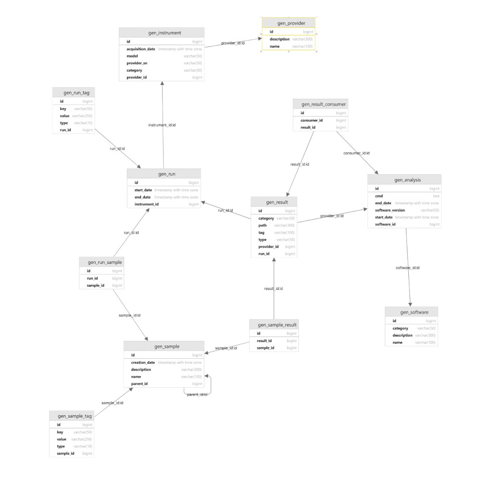
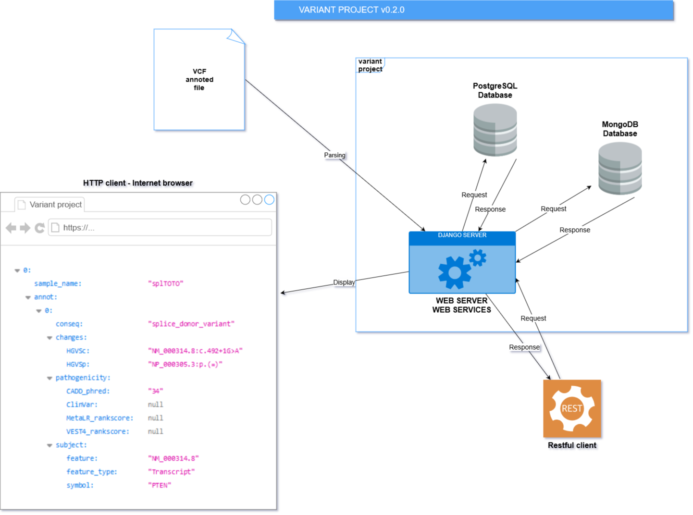

# Release 0.4.0 [2021-07-20]

### Changes

> The analyse data are managed.
> The main web services are implemented.

### Improvements

- The analyse data are now managed, the data relational model is available below :

- The sample demo data are deleted.
- Main web services are now available, the following lists present them :

**PDF documentation : Variant web services**

[Variant web services](./genesis/doc/web%20services/variant%20web%20services.pdf)

**PDF documentation : Analysis web services**

[Analysis web services](./genesis/doc/web%20services/analysis%20web%20services.pdf)

- The API library is updated.

- The server documentation is updated.
- The API document is updated.
- The code is refactored.

### Bug fixes

> Not applicable

# Release 0.3.0 [2021-07-20]

### Operating diagram for genesis server v0.3.0

### Changes

> A server API allows to do requests to the genesis server server thanks a simple python script and without know the server structure.

### Improvements

- The project name is renamed: **genesis server**.
- The API library is implemented.

- The documentation is updated.
- The code is refactored.

**CAUTION :** In this version, the sample object are not final.

### Bug fixes

> Not applicable.

# Release 0.2.0 [2021-06-25]

### Operating diagram for variant_project v0.2.0

### Changes

> The Django server manage both web application and web services :
>
> So, the FastAPI for web services is not used anymore.
> The Pydantic objects in accordance with the FastAPI documentation are not used anymore.

> Therefore, now only one server is used for managing two different applications :
>
>- Web application
>- Web services
>
> See the **Operating diagram part** above.

### Improvements

- The VCF variant files are parsed and recorded into mongoDB database.
- The variants can be displayed on internet client.
- Requests on variants are availables thanks web services.

- Samples are managed by the postgreSQL database.
- The sample management, and its components, are possible thanks the site admin interface.
- Requests on samples are availables thanks web services.

- The documentation is updated.
- The code is refactored.

**CAUTION :** In this version, the sample object are not final.

### Bug fixes

> Not applicable.

# Release 0.1.0 [2021-06-15]

> First release.

### Operating diagram for variant_project v0.1.0

### Changes

> Not applicable.

### Improvements

The first version allows parsing and management of variants, requests on them and displaying.

It is a version for some tests and technical checks.

### Bug fixes

> Not applicable.
